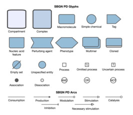

# SyBValS
**Sy**stems **B**iology **Val**idation **S**ervice (SyBValS) is a web service to validate maps in SBGNML format and to produce graphical images of the map with an option to highlight errors. After validating maps, if desired, SyBValS will resolve these errors when possible, reproducing the image after any fixes.

Here is an example map with errors after the user applies **Validate**:


Notice how each error is color-coded both in its text description and in the image, respectively.

Here is the same map after the user applied **Resolve Errors**:


All problems have now been fixed.

The main capabilities of SyBValS include:
- validate and create an image of a map in SBGNML format, and
- resolve the errors in a map in SBGNML format and recreate an image of the validated map.

Backed by these capabilities, SyBValS can be used to validate, resolve, and generate images of SBGN models (e.g., for including in web pages or scientific articles).

SyBValS is distributed under the [MIT License](https://github.com/iVis-at-Bilkent/sbgn-validation-service/blob/main/LICENSE).
Here is a sample server deployment along with a simple client-side demo:

<p align="center">
<a href="http://sybvals.cs.bilkent.edu.tr"></a>
</p>

## Setup of a service

In order to deploy and run a local instance of the service, please follow the steps below:

### Installation
```
git clone https://github.com/iVis-at-Bilkent/sbgn-validation-service.git
cd sbgn-validation-service
npm install   // this may take a while
```

### Starting server
The default port is 3400, you can change it by setting 'PORT' environment variable.
```
npm run start
```

**Note #1:** We recommend the use of Node.js version 14.x and npm version 6.x. We used Node.js v14.20.1 and npm v6.14.8 during development.

**Note #2:** This service uses [Puppeteer](https://pptr.dev) to generate the output. Please refer to the [Puppeteer documentation](https://github.com/puppeteer/puppeteer/blob/main/docs/troubleshooting.md#troubleshooting) to ensure that your machine is configured properly to run Chrome headlessly.

### Docker
Alternatively, you can use Dockerfile provided in the root directory. Please note that Dockerfile currently works in Linux and Windows environments and **does not** work in macOS because of Puppeteer related issues. To run the Dockerfile (below commands may require *sudo* in Linux environment):

First, `cd` into the folder where Dockerfile is located.

Then, build a Docker image with name *sybvals* (this may take a while).
```
docker build -t sybvals .
```
Lastly, run the image from port 3000. If you want to use another port, please change the first port number in below command.
```
docker run -p 3400:3400 sybvals
```

## Supported formats
SyBValS supports the following input formats for graphs:
[SBGNML](https://github.com/sbgn/sbgn/wiki/SBGN_ML)

The notations used for these formats:

SBGNML Stylesheet
-------------------------
<a href="https://raw.githubusercontent.com/iVis-at-Bilkent/sbgn-validation-service/main/img/SBGNML_stylesheet.svg" title="SBGNML stylesheet"></a>

## Usage

Sending request to the local deployment via curl to validate map:
```
curl -X POST -H "Content-Type: text/plain" --data "request_body" http://localhost:3400/validation
```
and via Fetch API 

```
let settings = {
  method: 'POST',
  headers: {
    Accept: 'application/json',
    'Content-Type': 'text/plain'
  },
  body: request_body
};

let result = await fetch("http://localhost:3400/validation", settings)
  .then(response => response.json())
  .then(res => {
    return res;
  })
  .catch(e => {
    return e;
  });
```

where `validation` is indicating validation is applied to map in `sbgnml`.

`request_body`  needs to be formed in the following way:

If the file content is in JSON format:
```
JSON.stringfy([JSON.parse(file_content), options])
```
If the file content is in other formats:
```
file_content + JSON.stringfy(options)
```
where `options` is an object consisting of `imageOptions`. Example:
```
options = {
  imageOptions: {
    format: 'png',              // output format
    background: 'transparent',  // background color
    width: 1280,                // desired width
    height: 720,                // desired height
    color: '#9ecae1'            // node color
    fullGraph: true            // desired map format, if true there is no empty pixel in image
  }
}
```
**Note:** While sending the requests via curl, any `"` in the `request_body` should be replaced with `\"` and all newline characters should be removed.

 Image options support three output formats: `png`, `jpg` and `svg`. `background` attribute should be a hex color code or `transparent` and one of the following predefined color schemes for the SBGNML format: `bluescale`, `greyscale`, `red_blue`, `green_brown`, `purple_brown`, `purple_green`, `grey_red`, and `black_white`.


After the request is sent, the server will validate the map in SBGNML format and produce image of map with highlighted errors format (in `base64uri` encoding for `png` and `jpg` formats and in `xml` for the `svg` format). It will return image of map and errors as a response.

If an error occurs, the response of the server will consist of an error message.

For instance, a sample SBGNML file can be validated and a corresponding PNG image can be generated by making a query to the sample deployment of SyBValS web service via curl in the following way:
```
curl -X POST -H "Content-Type: text/plain" --data "<?xml version='1.0' encoding='UTF-8'?><sbgn xmlns='http://sbgn.org/libsbgn/0.3'>  <map version='http://identifiers.org/combine.specifications/sbgn.pd.level-1.version-1.3' id='map1'> <glyph class='simple chemical' id='glyph1'>	<label text='DHA-P'/> <bbox x='30' y='20' w='60' h='60'/> </glyph> <glyph class='simple chemical' id='glyph2'> <label text='GA-3P' /> <bbox x='30' y='220' w='60' h='60'/> </glyph> <glyph class='macromolecule' id='glyph3'> <label text='Triose-P&#xA;Isomerase' /> <bbox x='150' y='120' w='120' h='60'/>	</glyph> <glyph class='process' orientation='vertical' id='pn1'> <bbox x='50' y='140' w='20' h='20'/> <port x='60' y='130' id='pn1.1'/> <port x='60' y='170' id='pn1.2'/> </glyph> <arc class='production' source='pn1.1' target='glyph1' id='a1'> <start x='60' y='130' /> <end x='60' y='80' /> </arc> <arc class='production' source='pn1.2' target='glyph2' id='a2'> <start x='60' y='170' /> <end x='60' y='220' />	</arc> <arc class='catalysis' source='glyph3' target='pn1' id='a3'> <start x='150' y='150' /> <end x='70' y='150' /> </arc>  </map></sbgn>{\"imageOptions\":{\"format\":\"png\",\"background\":\"transparent\", \"width\": 1280, \"height\": 1280, \"color\":\"bluescale\"}}" http://sybvals.cs.bilkent.edu.tr/validation
```
The same query can be done via Fetch API in the following way:
```
let settings = {
  method: 'POST',
  headers: {
    Accept: 'application/json',
    'Content-Type': 'text/plain'
  },
  body: <?xml version='1.0' encoding='UTF-8'?>
        <sbgn xmlns='http://sbgn.org/libsbgn/0.3'>
          <map version='http://identifiers.org/combine.specifications/sbgn.pd.level-1.version-1.3' id='map1'>
          <glyph class='simple chemical' id='glyph1'>
            <label text='DHA-P'/>
            <bbox x='30' y='20' w='60' h='60'/>
          </glyph>
          <glyph class='simple chemical' id='glyph2'>
            <label text='GA-3P' />
            <bbox x='30' y='220' w='60' h='60'/>
          </glyph>
          <glyph class='macromolecule' id='glyph3'>
            <label text='Triose-P&#xA;Isomerase' /> <!-- contains line break -->
            <bbox x='150' y='120' w='120' h='60'/>
          </glyph>
          <glyph class='process' orientation='vertical' id='pn1'>
            <bbox x='50' y='140' w='20' h='20'/>
            <port x='60' y='130' id='pn1.1'/>
            <port x='60' y='170' id='pn1.2'/>
          </glyph>
          <arc class='production' source='pn1.1' target='glyph1' id='a1'>
            <start x='60' y='130' />
            <end x='60' y='80' />
          </arc>
          <arc class='production' source='pn1.2' target='glyph2' id='a2'>
            <start x='60' y='170' />			
            <end x='60' y='220' />
          </arc>
          <arc class='catalysis' source='glyph3' target='pn1' id='a3'>
            <start x='150' y='150' />
            <end x='70' y='150' />			
          </arc>
          </map>
        </sbgn>{imageOptions":{"format":"png","background":"transparent","width":1280,"height":720,"color":"bluescale"}} // file_content + JSON.stringfy(options)
};

let result = await fetch("http://sybvals.cs.bilkent.edu.tr/validation, settings)
  .then(response => response.json())
  .then(res => {
    return res;
  })
  .catch(e => {
    return e;
  });
  
let imageInfo = result["image"];     // data:image/png;base64,iVBORw0KGgoAAAANSUhE... (in `base64uri` for `png` and `jpg` and in `xml` for `svg`)
```

Sending request to the local deployment via curl to resolve errors after validation of map:
```
curl -X POST -H "Content-Type: text/plain" --data "request_body" http://localhost:3400/fixError
```
and via Fetch API 

```
let settings = {
  method: 'POST',
  headers: {
    Accept: 'application/json',
    'Content-Type': 'text/plain'
  },
  body: request_body
};

let result = await fetch("http://localhost:3400/fixError", settings)
  .then(response => response.json())
  .then(res => {
    return res;
  })
  .catch(e => {
    return e;
  });
```

where `fixError` is indicating error resolving is applied to map in `sbgnml`.

`request_body`  needs to be formed in the following way:

If the file content is in JSON format:
```
JSON.stringfy([JSON.parse(file_content), options])
```
If the file content is in other formats:
```
file_content + JSON.stringfy(options)
```
where `options` is an object consisting of `imageOptions`. Example:
```
options = {
  imageOptions: {
    format: 'png',              // output format
    background: 'transparent',  // background color
    width: 1280,                // desired width
    height: 720,                // desired height
    color: '#9ecae1'            // node color
    fullGraph: true            // desired map format, if true there is no empty pixel in image
  }
}
```
**Note:** While sending the requests via curl, any `"` in the `request_body` should be replaced with `\"` and all newline characters should be removed.

 Image options support three output formats: `png`, `jpg` and `svg`. `background` attribute should be a hex color code or `transparent` and one of the following predefined color schemes for the SBGNML format: `bluescale`, `greyscale`, `red_blue`, `green_brown`, `purple_brown`, `purple_green`, `grey_red`, and `black_white`.


After the request is sent, the server will try to solve each error and explanation will be added for the resolved errors. It will again produce image of map with highlighted errors after resolve is done (in `base64uri` encoding for `png` and `jpg` formats and in `xml` for the `svg` format). It will return image of map and errors as a response.

If an error occurs, the response of the server will consist of an error message.

For instance, errors in a sample SBGNML file can be resolved out and corresponding PNG image can be generated by making a query to the sample deployment of SyBValS web service via curl in the following way:
```
curl -X POST -H "Content-Type: text/plain" --data "<?xml version='1.0' encoding='UTF-8'?><sbgn xmlns='http://sbgn.org/libsbgn/0.3'>  <map version='http://identifiers.org/combine.specifications/sbgn.pd.level-1.version-1.3' id='map1'> <glyph class='simple chemical' id='glyph1'>	<label text='DHA-P'/> <bbox x='30' y='20' w='60' h='60'/> </glyph> <glyph class='simple chemical' id='glyph2'> <label text='GA-3P' /> <bbox x='30' y='220' w='60' h='60'/> </glyph> <glyph class='macromolecule' id='glyph3'> <label text='Triose-P&#xA;Isomerase' /> <bbox x='150' y='120' w='120' h='60'/>	</glyph> <glyph class='process' orientation='vertical' id='pn1'> <bbox x='50' y='140' w='20' h='20'/> <port x='60' y='130' id='pn1.1'/> <port x='60' y='170' id='pn1.2'/> </glyph> <arc class='production' source='pn1.1' target='glyph1' id='a1'> <start x='60' y='130' /> <end x='60' y='80' /> </arc> <arc class='production' source='pn1.2' target='glyph2' id='a2'> <start x='60' y='170' /> <end x='60' y='220' />	</arc> <arc class='catalysis' source='glyph3' target='pn1' id='a3'> <start x='150' y='150' /> <end x='70' y='150' /> </arc>  </map></sbgn>{\"imageOptions\":{\"format\":\"png\",\"background\":\"transparent\", \"width\": 1280, \"height\": 1280, \"color\":\"bluescale\"}}" http://sybvals.cs.bilkent.edu.tr/fixError
```
The same query can be done via Fetch API in the following way:
```
let settings = {
  method: 'POST',
  headers: {
    Accept: 'application/json',
    'Content-Type': 'text/plain'
  },
  body: <?xml version='1.0' encoding='UTF-8'?>
        <sbgn xmlns='http://sbgn.org/libsbgn/0.3'>
          <map version='http://identifiers.org/combine.specifications/sbgn.pd.level-1.version-1.3' id='map1'>
          <glyph class='simple chemical' id='glyph1'>
            <label text='DHA-P'/>
            <bbox x='30' y='20' w='60' h='60'/>
          </glyph>
          <glyph class='simple chemical' id='glyph2'>
            <label text='GA-3P' />
            <bbox x='30' y='220' w='60' h='60'/>
          </glyph>
          <glyph class='macromolecule' id='glyph3'>
            <label text='Triose-P&#xA;Isomerase' /> <!-- contains line break -->
            <bbox x='150' y='120' w='120' h='60'/>
          </glyph>
          <glyph class='process' orientation='vertical' id='pn1'>
            <bbox x='50' y='140' w='20' h='20'/>
            <port x='60' y='130' id='pn1.1'/>
            <port x='60' y='170' id='pn1.2'/>
          </glyph>
          <arc class='production' source='pn1.1' target='glyph1' id='a1'>
            <start x='60' y='130' />
            <end x='60' y='80' />
          </arc>
          <arc class='production' source='pn1.2' target='glyph2' id='a2'>
            <start x='60' y='170' />			
            <end x='60' y='220' />
          </arc>
          <arc class='catalysis' source='glyph3' target='pn1' id='a3'>
            <start x='150' y='150' />
            <end x='70' y='150' />			
          </arc>
          </map>
        </sbgn>{imageOptions":{"format":"png","background":"transparent","width":1280,"height":720,"color":"bluescale","fullGraph":"true"}} // file_content + JSON.stringfy(options)
};

let result = await fetch("http://sybvals.cs.bilkent.edu.tr/fixError, settings)
  .then(response => response.json())
  .then(res => {
    return res;
  })
  .catch(e => {
    return e;
  });
  
let imageInfo = result["image"];     // data:image/png;base64,iVBORw0KGgoAAAANSUhE... (in `base64uri` for `png` and `jpg` and in `xml` for `svg`)
```

## Credits

SyBValS uses [the Express framework](https://expressjs.com/) for handling HTTP requests. Actual operations are performed using [Cytoscape.js](https://js.cytoscape.org) and its extensions (see the `package.json` file for a complete listing). Among these extensions, [Cytosnap](https://github.com/cytoscape/cytosnap) is particularly needed for creating a headless Chrome instance, on which graph creation, rendering, layout and image creation of the input graphs are performed.

Icons in the client demo are made by [Freepik](http://www.freepik.com) and [Flaticon](https://www.flaticon.com) licensed with 
[Creative Commons BY 3.0](http://creativecommons.org/licenses/by/3.0/).

Third-party libraries used in web service:
[sbgnml-to-cytoscape](https://www.npmjs.com/package/sbgnml-to-cytoscape),
[cytoscape-sbgn-stylesheet](https://github.com/iVis-at-Bilkent/cytoscape-sbgn-stylesheet),
[cytosnap](https://github.com/iVis-at-Bilkent/cytosnap),
[libsbmljs](https://libsbmljs.github.io),
[express](https://www.npmjs.com/package/express),
[cors](https://www.npmjs.com/package/cors),
[jQuery](https://www.npmjs.com/package/jquery),
[jsdom](https://www.npmjs.com/package/jsdom),
[nodemon](https://www.npmjs.com/package/nodemon),
[jest](https://www.npmjs.com/package/jest),
[super-test](https://www.npmjs.com/package/supertest)

Third-party libraries used in demo client:
[Semantic UI](https://semantic-ui.com),
[underscore.js](https://underscorejs.org),
[backbone.js](https://backbonejs.org),
[FileSaver.js](https://github.com/eligrey/FileSaver.js/)

## Team

[Yusuf Ziya Özgül](https://github.com/YusufZiyaOzgul), [Hasan Balci](https://github.com/hasanbalci) and [Ugur Dogrusoz](https://github.com/ugurdogrusoz) of [i-Vis at Bilkent University](http://www.cs.bilkent.edu.tr/~ivis)
