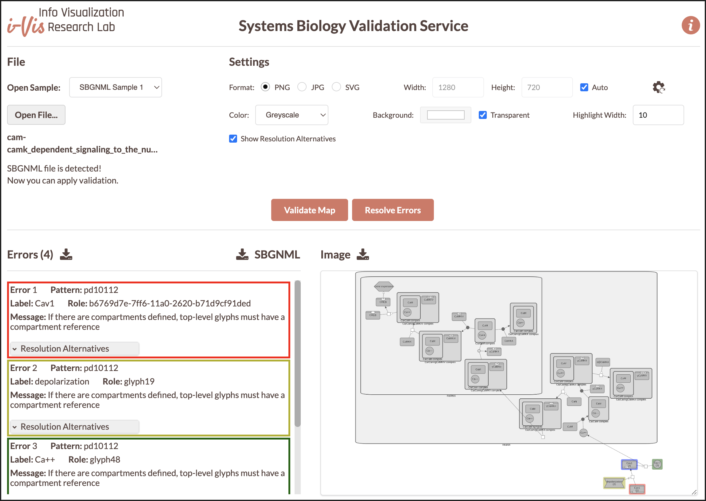
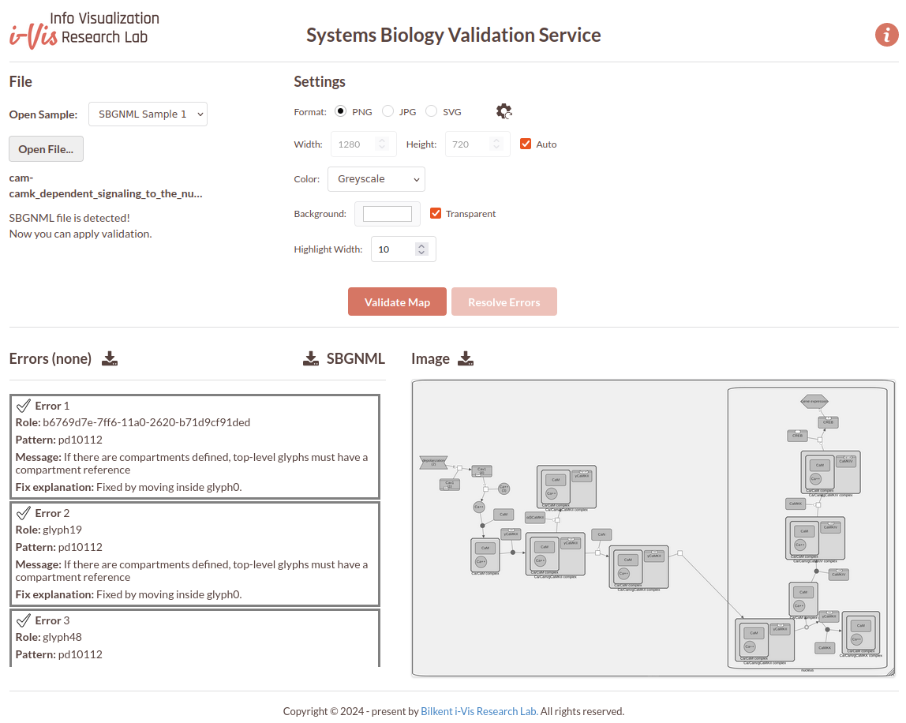
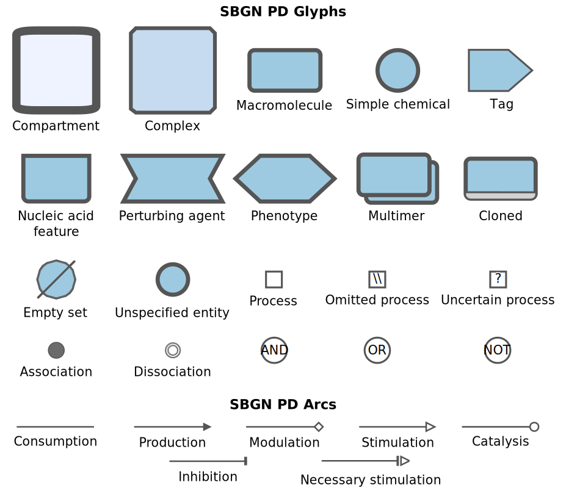

# SyBValS
**Sy**stems **B**iology **Val**idation **S**ervice (SyBValS) is a web service that validates maps in SBGNML format and produces graphical images of the map with an option to highlight errors. After validating maps, if desired, SyBValS will resolve these errors when possible, reproducing the image after any fixes and returning the corrected SBGN file. During the resolution of errors, the user is also provided with possible choices when applicable, or the errors are resolved with default choices.

Here is a video tutorial:
<div align="middle">
      <a href="https://youtu.be/e4iroz304XM" target="_blank">
         
      </a>
</div>

Please cite the following when you use SyBValS:

&nbsp;&nbsp;Y.Z. Ozgul, U. Dogrusoz and H. Balci, "SyBValS: a validation and error resolution service for biological pathways", under review, 2024.

Here is an example from our simple demo on a sample deployment. Below is a list of errors found by the service for the map provided by the user upon **Validate**:



Notice how each error is color-coded both in its text description and in the image, respectively. Also, the user is provided with
resolution alternatives when applicable.

Here is the same map after the user applied **Resolve Errors**:



All problems have now been fixed.

The main capabilities of SyBValS include:
- validate and create an image of a map in SBGNML format, and
- resolve the errors in a map in SBGNML format, recreate an image of the validated map, and produce a corrected version of the input SBGN file.

Backed by these capabilities, SyBValS can be used to validate, resolve, and generate images of SBGN models (e.g., for including in web pages or scientific articles).

SyBValS is distributed under the [MIT License](https://github.com/iVis-at-Bilkent/sbgn-validation-service/blob/main/LICENSE).

Here is a sample server deployment along with a simple client-side demo:

<p align="center">
<a href="http://sybvals.cs.bilkent.edu.tr"></a>
</p>

Sample maps used in the demo are taken from:
- Systems Biology Graphical Notation: PD Level 1 examples - IFN regulation.
https://sbgn.github.io/examples#ifn-regulation.
- McCormick, D.B., Chen, H.: Update on interconversions of vitamin b-6 with its
coenzyme. J Nutr. 129(2), 325–7 (1999) https://doi.org/10.1093/jn/129.2.325
- Van Wijk, R., Van Solinge, W.W.: The energy-less red blood cell is lost: erythrocyte enzyme abnormalities of glycolysis. Blood 106(13), 4034–4042 (2005)
https://doi.org/10.1182/blood-2005-04-1622
- Ma, H., Groth, R.D., Cohen, S.M., Emery, J.F., Li, B., Hoedt, E., Zhang, G.,
Neubert, T.A., Tsien, R.W.: γcamkii shuttles ca2+/cam to the nucleus to trigger
creb phosphorylation and gene expression. Cell 159(2), 281–294 (2014)
https://doi.org/0.1016/j.cell.2014.09.019
- Systems Biology Graphical Notation: PD Level 1 examples - Neuro-muscular
junction. https://sbgn.github.io/examples#neuro-muscular-junction.

<!--
A video tutorial for using this demo is below:
[](https://www.youtube.com/watch?v=arK32LKHxzM "SyBValS")
--->

## Setup of a service

In order to deploy and run a local instance of the service, please follow the steps below:

### Installation
```
git clone https://github.com/iVis-at-Bilkent/sybvals.git
cd sybvals
npm install   // this may take a while
```

### Starting server
The default port is 3400, you can change it by setting 'PORT' environment variable.
```
npm run start
```

**Note #1:** We recommend the use of Node.js version 20.x and npm version 10.x. We used Node.js v20.14.0 and npm v10.7.0 during development.

**Note #2:** This service uses [Puppeteer](https://pptr.dev) to generate the output. Please refer to the [Puppeteer documentation](https://github.com/puppeteer/puppeteer/blob/main/docs/troubleshooting.md#troubleshooting) to ensure that your machine is configured properly to run Chrome headlessly.

### Docker
Alternatively, you can use Dockerfile provided in the root directory. Please note that Dockerfile currently works in Linux and Windows environments and **does not** work in macOS because of Puppeteer related issues. To run the Dockerfile (below commands may require *sudo* in Linux environment):

First, `cd` into the folder where Dockerfile is located.

Then, build a Docker image with name *sybvals* (this may take a while).
```
docker build -t sybvals .
```
Lastly, run the image from port 3400. If you want to use another port, please change the first port number in below command.
```
docker run -p 3400:3400 sybvals
```

## Supported format and validation rules
SyBValS supports [SBGNML](https://github.com/sbgn/sbgn/wiki/SBGN_ML) as the input format. The notation used for this format:

### SBGNML Stylesheet
-------------------------
<a href="https://raw.githubusercontent.com/iVis-at-Bilkent/sbgn-validation-service/main/img/SBGNML_stylesheet.svg" title="SBGNML stylesheet"></a>

### Validation Rules
SyBValS uses the validation rules defined in [libSBGN](https://github.com/sbgn/libsbgn). Below table lists the following for each validation problem:
- error code,
- associated message,
- action to be taken by SyBValS to highlight the problem and
- action to be taken by SyBValS to fix the problem
<details open>
  <summary>Validation Rule Table</summary>

<table><thead>
  <tr>
    <th>Error Code</th>
    <th>Associated Message</th>
    <th>Highlight Action</th>
    <th>Fix Action</th>
  </tr></thead>
<tbody>
  <tr>
    <td>00001</td>
    <td>ID needs to be unique</td>
    <td>Incorrect file format (glyph/arc with non-unique ID will be ignored)</td>
    <td>-</td>
  </tr>
  <tr>
    <td>00002</td>
    <td>An arc source/target should be a glyph defined in the diagram</td>
    <td>Incorrect file format (arc with non-existent source/target will be ignored)</td>
    <td>-</td>
  </tr>
  <tr>
    <td rowspan="2">pd10101</td>
    <td>Arc with class consumption must have source reference to glyph of EPN classes</td>
    <td>Highlight consumption arc that does not comply with the rule</td>
    <td>Swap the source and target of the arc if they seem to be reversed</td>
  </tr>
  <tr>
    <td colspan="3"><details><summary>Show Example</summary>
</details></td>
  </tr>
  <tr>
    <td rowspan="2">pd10102</td>
    <td>Arc with class consumption must have target reference to port on glyph with PN classes</td>
    <td>Highlight consumption arc that does not comply with the rule</td>
    <td>Swap the source and target of the arc if they seem to be reversed</td>
  </tr>
  <tr>
    <td colspan="3"><details><summary>Show Example</summary>
</details></td>
  </tr>
  <tr>
    <td rowspan="2">pd10103</td>
    <td>The 'source and sink' glyph can be connected to at most one consumption arc</td>
    <td>Highlight 'source and sink' glyph that does not comply with the rule</td>
    <td>Split the 'source and sink' glyph for each consumption arc</td>
  </tr>
  <tr>
    <td colspan="3"><details><summary>Show Example</summary>
</details></td>
  </tr>
  <tr>
    <td rowspan="2">pd10104</td>
    <td>The 'dissociation' glyph can only be connected to one consumption arc</td>
    <td>Highlight multiple consumption arcs connected to the dissociation</td>
    <td>List all such consumption arcs and ask to identify the correct one and remove the others</td>
  </tr>
  <tr>
    <td colspan="3"><details><summary>Show Example</summary>
</details></td>
  </tr>
  <tr>
    <td rowspan="2">pd10105</td>
    <td>Arc with class production must have source reference to port on glyph with PN classes</td>
    <td>Highlight production arcs that do not comply with the rule</td>
    <td>Swap the source and target of the arc if that looks like fixing the problem</td>
  </tr>
  <tr>
    <td colspan="3"><details><summary>Show Example</summary>
</details></td>
  </tr>
  <tr>
    <td rowspan="2">pd10106</td>
    <td>Arc with class production must have target reference to glyph of EPN classes</td>
    <td>Highlight production arcs that do not comply with the rule</td>
    <td>Swap the source and target of the arc if that looks like fixing the problem</td>
  </tr>
  <tr>
    <td colspan="3"><details><summary>Show Example</summary>
</details></td>
  </tr>
  <tr>
    <td rowspan="2">pd10107</td>
    <td>The 'source and sink' glyph can be connected to at most one production glyph</td>
    <td>Highlight 'source and sink' glyphs that do not comply with the rule as well as the connected arcs</td>
    <td>Split the 'source and sink' glyph for each production arc</td>
  </tr>
  <tr>
    <td colspan="3"><details><summary>Show Example</summary>
</details></td>
  </tr>
  <tr>
    <td rowspan="2">pd10108</td>
    <td>The association glyph can only be connected to one production glyph</td>
    <td>Highlight the association glyph connected to multiple production glyphs</td>
    <td>List all such production arcs and ask to identify the correct one and remove the others</td>
  </tr>
  <tr>
    <td colspan="3"><details><summary>Show Example</summary>
</details></td>
  </tr>
  <tr>
    <td rowspan="2">pd10109</td>
    <td>Modulation arc must have source reference to glyph of EPN classes or a logical operator</td>
    <td>Highlight modulation arcs that do not comply with the rule</td>
    <td>List nearby EPNs and logical operators and ask to choose the right source</td>
  </tr>
  <tr>
    <td colspan="3"><details><summary>Show Example</summary>
</details></td>
  </tr>
  <tr>
    <td rowspan="2">pd10110</td>
    <td>Modulation arc must have target reference to PN classes</td>
    <td>Highlight modulation arcs that do not comply with the rule</td>
    <td>List nearby PNs and ask to choose the right target</td>
  </tr>
  <tr>
    <td colspan="3"><details><summary>Show Example</summary>

</details></td>
  </tr>
  <tr>
    <td rowspan="2">pd10111</td>
    <td>and', 'or', and 'not' glyphs must be the source for exactly one arc</td>
    <td>Highlight multiple outgoing arcs</td>
    <td>List all such arcs and ask which to keep and remove the others</td>
  </tr>
  <tr>
    <td colspan="3"><details><summary>Show Example</summary>
</details></td>
  </tr>
  <tr>
    <td rowspan="2">pd10112</td>
    <td>If there are compartments defined, top-level glyphs must have a compartmentRef</td>
    <td>Highlight any such glyph(s) not having a compartmentRef</td>
    <td>List top-level compartments, ask to select one of listed compartments and place the glyph inside the selected compartment</td>
  </tr>
  <tr>
    <td colspan="3"><details><summary>Show Example</summary>
</details></td>
  </tr>
  <tr>
    <td rowspan="2">pd10124</td>
    <td>Arc with class logic arc must have source reference to glyph of EPN classes, or logic gates</td>
    <td>Highlight logic arcs that do not comply with the rule</td>
    <td>List nearby glyphs that are valid sources for the problematic logic arc and ask to choose the right one, and connect the logic arc to it instead</td>
  </tr>
  <tr>
    <td colspan="3"><details><summary>Show Example</summary>
</details></td>
  </tr>
  <tr>
    <td>pd10125</td>
    <td>Arc with class logic arc must have target reference to a logical operator</td>
    <td>Highlight logic arcs that do not comply with the rule</td>
    <td>List nearby logical operators that are valid targets for the problematic logic arc and ask to choose the right one, and connect the logic arc to it instead</td>
  </tr>
  <tr>
    <td>pd10126</td>
    <td>The 'not' glyph can only be the target of one logic arc glyph</td>
    <td>Highlight multiple incoming arcs</td>
    <td>List all logic arcs connected to the problematic ‘not’ glyph, and ask to choose the right one to keep and remove the others</td>
  </tr>
  <tr>
    <td>pd10127</td>
    <td>Arc with class equivalence arc must have source reference to glyph of EPN classes</td>
    <td>Highlight equivalence arcs that do not comply with the rule</td>
    <td>List nearby EPNs and ask to choose the right source for the problematic equivalence arc</td>
  </tr>
  <tr>
    <td>pd10128</td>
    <td>Arc with class equivalence arc must have target reference to glyph of classes 'tag', 'submap' or 'terminal'</td>
    <td>Highlight equivalence arcs that do not comply with the rule</td>
    <td>List nearby glyphs that are valid (‘tag’, ‘submap’ or ‘terminal’) and ask to choose the right one to connect the problematic equivalence arc to.</td>
  </tr>
  <tr>
    <td>pd10129</td>
    <td>All state variables associated with a Stateful Entity Pool Node should be unique and not duplicated within that node</td>
    <td>Highlight duplicate state variables</td>
    <td>-</td>
  </tr>
  <tr>
    <td>pd10131</td>
    <td>EPNs should not be orphaned (i.e. they must be associated with at least one arc)</td>
    <td>Highlight orphaned EPNs</td>
    <td>-</td>
  </tr>
  <tr>
    <td>pd10132</td>
    <td>All process nodes (with the exception of phenotype) must have an LHS and RHS</td>
    <td>Highlight processes without LHS/RHS</td>
    <td>-</td>
  </tr>
  <tr>
    <td>pd10133</td>
    <td>All EPNs on the LHS of a process must be unique</td>
    <td>Highlight EPNs with the same name/ID (not just cloned EPNs but also same EPNs in different compartments)</td>
    <td>-</td>
  </tr>
  <tr>
    <td>pd10134</td>
    <td>If more than one set of stoichiometries can be applied to the flux arcs of the process then the stoichiometry of the flux arcs must be displayed</td>
    <td>-</td>
    <td>-</td>
  </tr>
  <tr>
    <td>pd10135</td>
    <td>If the stoichiometry is undefined or unknown this should be indicated by the use of a question mark ("?")</td>
    <td>-</td>
    <td>-</td>
  </tr>
  <tr>
    <td>pd10140</td>
    <td>This 'glyph class' is not allowed in Process Description</td>
    <td>The glyph with invalid 'glyph class' will be ignored</td>
    <td>-</td>
  </tr>
  <tr>
    <td>pd10141</td>
    <td>All process nodes should have at least one input and at least one output pointing to the arcs</td>
    <td>Highlight processes with missing arcs</td>
    <td>List nearby EPNs and ask to choose the right input/output if the input/output is missing and add the appropriate edge (consumption/production) between selected node and process</td>
  </tr>
  <tr>
    <td>pd10142</td>
    <td>Logic arc must be connected to either 'OR', 'AND' or 'NOT'</td>
    <td>Highlight logic arcs that are not connected to either 'OR', 'AND' or 'NOT'</td>
    <td>-</td>
  </tr>
  <tr>
    <td>pd10142</td>
    <td>Logic arc must be connected to either 'OR', 'AND' or 'NOT'</td>
    <td>Highlight logic arcs that are not connected to either 'OR', 'AND' or 'NOT'</td>
    <td>-</td>
  </tr>
</tbody></table>


  
| Error&nbsp;Code	| Associated Message                                                                                                                               	| Highlight Action                                                                                         	|                                                                          Fix Action                                                                         	|
|:----------:	|--------------------------------------------------------------------------------------------------------------------------------------------------	|----------------------------------------------------------------------------------------------------------	|-----------------------------------------------------------------------------------------------------------------------------------------------------------	|
|   00001  	| ID needs to be unique                                                                    	| Incorrect file format (glyph/arc with non-unique ID will be ignored)                                             	| -                                                                                         	|
|   00002  	| An arc source/target should be a glyph defined in the diagram                                                           	| Incorrect file format (arc with non-existent source/target will be ignored)                                             	| -
|   pd10101  	| Arc with class consumption must have source reference to glyph of EPN classes                                                                    	| Highlight consumption arc that does not comply with the rule                                             	| Swap the source and target of the arc if they seem to be reversed                                                                                         	|
|   pd10102  	| Arc with class consumption must have target reference to port on glyph with PN classes                                                           	| Highlight consumption arc that does not comply with the rule                                             	| Swap the source and target of the arc if they seem to be reversed                                                                                               	|
|   pd10103  	| The 'source and sink' glyph can be connected to at most one consumption arc                                                                      	| Highlight 'source and sink' glyph that does not comply with the rule                                     	| Split the 'source and sink' glyph for each consumption arc                                                                                                  	|
|   pd10104  	| The 'dissociation' glyph can only be connected to one consumption arc                                                                          	| Highlight multiple consumption arcs connected to the dissociation                                      	| List all such consumption arcs and ask to identify the correct one and remove the others                                                                 	|
|   pd10105  	| Arc with class production must have source reference to port on glyph with PN classes                                                            	| Highlight production arcs that do not comply with the rule                                               	| Swap the source and target of the arc if that looks like fixing the problem                                                                                 	|
|   pd10106  	| Arc with class production must have target reference to glyph of EPN classes                                                                     	| Highlight production arcs that do not comply with the rule                                               	| Swap the source and target of the arc if that looks like fixing the problem                                                                                	|
|   pd10107  	| The 'source and sink' glyph can be connected to at most one production glyph                                                                     	| Highlight 'source and sink' glyphs that do not comply with the rule as well as the connected arcs        	| Split the 'source and sink' glyph for each production arc                                                                                                    	|
|   pd10108  	| The association glyph can only be connected to one production glyph                                                                              	| Highlight the association glyph connected to multiple production glyphs                                  	| List all such production arcs and ask to identify the correct one and remove the others                                                                 	|
|   pd10109  	| Modulation arc must have source reference to glyph of EPN classes or a logical operator                                                          	| Highlight modulation arcs that do not comply with the rule                                               	| List nearby EPNs and logical operators and ask to choose the right source                                                                                  	|
|   pd10110  	| Modulation arc must have target reference to PN classes                                                                                          	| Highlight modulation arcs that do not comply with the rule                                               	| List nearby PNs and ask to choose the right target                                                                                                         	|
|   pd10111  	| and', 'or', and 'not' glyphs must be the source for exactly one arc                                                                              	| Highlight multiple outgoing arcs                                                                         	| List all such arcs and ask which to keep and remove the others                                                                                   	|
|   pd10112  	| If there are compartments defined, top-level glyphs must have a compartmentRef                                                                   	| Highlight any such glyph(s) not having a compartmentRef                                                  	| List top-level compartments, ask to select one of listed compartments and place the glyph inside the selected compartment                                      	|
|   pd10124  	| Arc with class logic arc must have source reference to glyph of EPN classes, or logic gates                                                      	| Highlight logic arcs that do not comply with the rule                                                    	| List nearby glyphs that are valid sources for the problematic logic arc and ask to choose the right one, and connect the logic arc to it instead             	|
|   pd10125  	| Arc with class logic arc must have target reference to a logical operator                                                                        	| Highlight logic arcs that do not comply with the rule                                                    	| List nearby logical operators that are valid targets for the problematic logic arc and ask to choose the right one, and connect the logic arc to it instead 	|
|   pd10126  	| The 'not' glyph can only be the target of one logic arc glyph                                                                                    	| Highlight multiple incoming arcs                                                                         	| List all logic arcs connected to the problematic ‘not’ glyph, and ask to choose the right one to keep and remove the others                                 	|
|   pd10127  	| Arc with class equivalence arc must have source reference to glyph of EPN classes                                                                	| Highlight equivalence arcs that do not comply with the rule                                              	| List nearby EPNs and ask to choose the right source for the problematic equivalence arc                                                                      |
|   pd10128  	| Arc with class equivalence arc must have target reference to glyph of classes 'tag', 'submap' or 'terminal'                                      	| Highlight equivalence arcs that do not comply with the rule                                              	| List nearby glyphs that are valid (‘tag’, ‘submap’ or ‘terminal’) and ask to choose the right one to connect the problematic equivalence arc to.                                                                                                                                                        	|
|   pd10129  	| All state variables associated with a Stateful Entity Pool Node should be unique and not duplicated within that node                             	| Highlight duplicate state variables                                                                      	|                                                                              -                                                                              	|
|   pd10131  	| EPNs should not be orphaned (i.e. they must be associated with at least one arc)                                                                 	| Highlight orphaned EPNs                                                                                  	|                                                                              -                                                                              	|
|   pd10132  	| All process nodes (with the exception of phenotype) must have an LHS and RHS                                                                     	| Highlight processes without LHS/RHS                                                                      	|                                                                              -                                                                              	|
|   pd10133  	| All EPNs on the LHS of a process must be unique                                                                                                  	| Highlight EPNs with the same name/ID (not just cloned EPNs but also same EPNs in different compartments) 	|                                                                              -                                                                              	|
|   pd10134  	| If more than one set of stoichiometries can be applied to the flux arcs of the process then the stoichiometry of the flux arcs must be displayed 	|                                                                              -                                  	|                                                                              -                                                                              	|
|   pd10135  	| If the stoichiometry is undefined or unknown this should be indicated by the use of a question mark ("?")                                        	|                                                                                                        - 	|                                                                              -                                                                              	|
|   pd10140  	| This 'glyph class' is not allowed in Process Description                                                                                         	| The glyph with invalid  'glyph class' will be ignored                                                       	|                                                                              -                                                                              	|
|   pd10141  	| All process nodes should have at least one input and at least one output pointing to the arcs                                                    	| Highlight processes with missing arcs                                                                    	| List nearby EPNs and ask to choose the right input/output if the input/output is missing and add the appropriate edge (consumption/production) between selected node and process                                                                                                                                                             	|
|   pd10142  	| Logic arc must be connected to either 'OR', 'AND' or 'NOT'                                                                                       	| Highlight logic arcs that are not connected to either 'OR', 'AND' or 'NOT'                               	|                                                                              -                                                                              	|
</details>

## Usage

Sending request to the local deployment via curl to validate map:

```
curl -X POST -H "Content-Type: text/plain" --data "request_body" http://localhost:3400/validation?showResolutionAlternatives=true
```
and via Fetch API 

```
let settings = {
  method: 'POST',
  headers: {
    Accept: 'application/json',
    'Content-Type': 'text/plain'
  },
  body: request_body
};

let result = await fetch("http://localhost:3400/validation?showResolutionAlternatives=true", settings)
  .then(response => response.json())
  .then(res => {
    return res;
  })
  .catch(e => {
    return e;
  });
```

where `validation` indicates a validation is to be applied to the specified map in SBGNML and `showResolutionAlternatives` parameter (true by default) represents whether resolution alternatives should be returned together with the errors or not.

`request_body`  needs to be formed in the following way:
```
file_content + JSON.stringfy(options)
```
where `options` is an object consisting of `imageOptions`. Example:
```
options = {
  imageOptions: {
    format: 'png',              // output format
    background: 'transparent',  // background color
    color: 'greyscale'          // node color
    width: 1280,                // desired width
    height: 720,                // desired height
    autoSize: true,             // automatically size image with no padding
    highlightWidth: 10          // underlay padding used to highlight errors
  }
}
```
**Note:** While sending the requests via curl, any `"` in the `request_body` should be replaced with `\"` and all newline characters should be removed.

Image options support three output formats: `png`, `jpg` and `svg`. `background` attribute should be a hex color code or `transparent`. `color` attribute should be one of the following predefined color schemes: `bluescale`, `greyscale`, `red_blue`, `green_brown`, `purple_brown`, `purple_green`, `grey_red`, and `black_white`. If `autoSize` attribute is `true`, then `width` and `height` values are ignored.

After the request is sent, the server will validate the map in SBGNML format and return the error information in JSON format and image information (in `base64uri` encoding for `png` and `jpg` formats and in `xml` for the `svg` format). Error information will contain error number, error pattern, textual explanation of the error, id of the graph element involved in the error, highlight color of the error in the corresponding image and the possible resolve alternatives for the error (`fixCandidates`).

As a second step, user can send a new query to resolve found errors (this time by using `fixError` option instead of `validation`) with the option to select desired resolve alternative. 

For instance, a sample SBGNML file can be validated and a corresponding PNG image can be generated by making a query to the sample deployment of SyBValS web service via curl in the following way:
```
curl -X POST -H "Content-Type: text/plain" --data "<?xml version='1.0' encoding='UTF-8' standalone='yes'?> <sbgn xmlns="http://sbgn.org/libsbgn/0.2">   <map language="process description"> <glyph id="glyph0" class="compartment"> <label text="juxtanuclear inclusion"/> <bbox x="768.3574923845551" y="546.0979745981155" w="96.5" h="109.75"/> </glyph> <glyph id="glyph39" class="macromolecule multimer"> <label text="Sis1"/> <clone/> <bbox x="929.2218432410954 y="594.256930786204" w="74" h="36"/> <glyph id="glyph39_0" class="unit of information"> <label text="N:2"/> <bbox x="965.8918432410954" y="586.256930786204" w="31" h="16"/> </glyph> </glyph> <glyph id="glyph1" class="compartment">       <label text="nucleus"/>       <bbox x="841.428570821784" y="678.639028298204" w="152.1663861546466" h="100.21659846106081"/> </glyph> <glyph id="glyph28" class="process"> <bbox x="965.1128141192878" y="696.4068854410611" w="10.714285714285715" h="10.714285714285715"/> <port id="glyph28.1" x="977.9699569764307" y="701.764028298204"/> <port id="glyph28.2" x="962.9699569764307" y="701.764028298204"/> </glyph>     <glyph id="glyph40" class="macromolecule multimer" compartmentRef="glyph1"> <label text="Sis1"/> <bbox x="857.0535708217841" y="722.2306267592649" w="74" h="36"/> <glyph id="glyph40_0" class="unit of information"> <label text="N:2"/> <bbox x="893.7235708217842" y="714.2306267592649" w="31" h="16"/> </glyph> </glyph>     <arc id="_8d624d9e-bc9c-4f3b-b842-02e0e2f44904" class="consumption" source="glyph40" target="glyph28.2"> <extension> <curveStyle>bezier</curveStyle> </extension> <start x="927.9813963068239" y="723.1519855768773"/> <end x="962.3449569764307" y="701.764028298204"/> </arc> <arc id="_7cf17394-4166-4140-80cd-c063e06c6794" class="production" source="glyph28.1" target="glyph39"> <extension> <curveStyle>bezier</curveStyle> </extension> <start x="978.5949569764307" y="701.764028298204"/> <end x="971.0283277407184" y="639.006807102588"/> </arc> </map> </sbgn>{\"imageOptions\":{\"format\":\"png\",\"background\":\"transparent\", \"width\": 1280, \"height\": 1280, \"color\":\"bluescale\", \"highlightWidth\": 10}}" http://sybvals.cs.bilkent.edu.tr/validation?showResolutionAlternatives=true
```
and the corresponding response with error and image information will be as follows:

```
{"errors":[{text: "If there are compartments defined, top-level glyphs must have a compartment reference\n", pattern: "pd10112", role: "glyph39", errorNo: 1,...}],"image":"data:image/png;base64,iVBORw0KGgoAAAANS..."
```

The same query can be done via Fetch API in the following way:
```
let settings = {
  method: 'POST',
  headers: {
    Accept: 'application/json',
    'Content-Type': 'text/plain'
  },
  body: file_content + {"imageOptions":{"format":"png","background":"transparent","width":1280,"height":720,"color":"bluescale","highlightWidth":10}} // file_content + JSON.stringfy(options)
};

let result = await fetch("http://sybvals.cs.bilkent.edu.tr/validation?showResolutionAlternatives=true, settings)
  .then(response => response.json())
  .then(res => {
    return res;
  })
  .catch(e => {
    return e;
  });

let errorInfo = result["errors"];                     // [{"text": "Arc with class consumption must have source reference to glyph of EPN classes",...}]
let imageInfo = result["imageErrorsHighlighted"];     // data:image/png;base64,iVBORw0KGgoAAAANSUhE... (in `base64uri` for `png` and `jpg` and in `xml` for `svg`)
```

Sending request to the sample deployment via curl to resolve errors after validation of map:

```
curl -X POST -H "Content-Type: text/plain" --data "<?xml version='1.0' encoding='UTF-8' standalone='yes'?> <sbgn xmlns="http://sbgn.org/libsbgn/0.2">   <map language="process description"> <glyph id="glyph0" class="compartment"> <label text="juxtanuclear inclusion"/> <bbox x="768.3574923845551" y="546.0979745981155" w="96.5" h="109.75"/> </glyph> <glyph id="glyph39" class="macromolecule multimer"> <label text="Sis1"/> <clone/> <bbox x="929.2218432410954 y="594.256930786204" w="74" h="36"/> <glyph id="glyph39_0" class="unit of information"> <label text="N:2"/> <bbox x="965.8918432410954" y="586.256930786204" w="31" h="16"/> </glyph> </glyph> <glyph id="glyph1" class="compartment">       <label text="nucleus"/>       <bbox x="841.428570821784" y="678.639028298204" w="152.1663861546466" h="100.21659846106081"/> </glyph> <glyph id="glyph28" class="process"> <bbox x="965.1128141192878" y="696.4068854410611" w="10.714285714285715" h="10.714285714285715"/> <port id="glyph28.1" x="977.9699569764307" y="701.764028298204"/> <port id="glyph28.2" x="962.9699569764307" y="701.764028298204"/> </glyph>     <glyph id="glyph40" class="macromolecule multimer" compartmentRef="glyph1"> <label text="Sis1"/> <bbox x="857.0535708217841" y="722.2306267592649" w="74" h="36"/> <glyph id="glyph40_0" class="unit of information"> <label text="N:2"/> <bbox x="893.7235708217842" y="714.2306267592649" w="31" h="16"/> </glyph> </glyph>     <arc id="_8d624d9e-bc9c-4f3b-b842-02e0e2f44904" class="consumption" source="glyph40" target="glyph28.2"> <extension> <curveStyle>bezier</curveStyle> </extension> <start x="927.9813963068239" y="723.1519855768773"/> <end x="962.3449569764307" y="701.764028298204"/> </arc> <arc id="_7cf17394-4166-4140-80cd-c063e06c6794" class="production" source="glyph28.1" target="glyph39"> <extension> <curveStyle>bezier</curveStyle> </extension> <start x="978.5949569764307" y="701.764028298204"/> <end x="971.0283277407184" y="639.006807102588"/> </arc> </map> </sbgn>{[{"text":"If there are compartments defined, top-level glyphs must have a compartment reference\n","pattern":"pd10112","role":"glyph39","errorNo":1,"label":"Sis1","colorCode":"#ff0000","status":"unsolved","fixCandidate":[{"label":"juxtanuclear inclusion","id":"glyph0"},{"label":"nucleus","id":"glyph1"}],"selectedOption":0}]\"imageOptions\":{\"format\":\"png\",\"background\":\"transparent\", \"width\": 1280, \"height\": 1280, \"color\":\"bluescale\", \"highlightWidth\": 10}}" http://sybvals.cs.bilkent.edu.tr/fixError?showResolutionAlternatives=true
```
The same query can be done via Fetch API in the following way:
```
let settings = {
  method: 'POST',
  headers: {
    Accept: 'application/json',
    'Content-Type': 'text/plain'
  },
  body: <?xml version='1.0' encoding='UTF-8' standalone='yes'?>
         <sbgn xmlns="http://sbgn.org/libsbgn/0.2">
           <map language="process description">
            <glyph id="glyph0" class="compartment">
             <label text="juxtanuclear inclusion"/>
             <bbox x="768.3574923845551" y="546.0979745981155" w="96.5" h="109.75"/>
            </glyph>
            <glyph id="glyph39" class="macromolecule multimer">
             <label text="Sis1"/>
             <clone/>
             <bbox x="929.2218432410954" y="594.256930786204" w="74" h="36"/>
              <glyph id="glyph39_0" class="unit of information">
               <label text="N:2"/>
               <bbox x="965.8918432410954" y="586.256930786204" w="31" h="16"/>
              </glyph>
            </glyph>
         <glyph id="glyph1" class="compartment">
          <label text="nucleus"/>
          <bbox x="841.428570821784" y="678.639028298204" w="152.1663861546466" h="100.21659846106081"/>
          </glyph>
         <glyph id="glyph28" class="process">
          <bbox x="965.1128141192878" y="696.4068854410611" w="10.714285714285715" h="10.714285714285715"/>
           <port id="glyph28.1" x="977.9699569764307" y="701.764028298204"/>
           <port id="glyph28.2" x="962.9699569764307" y="701.764028298204"/>
         </glyph>
         <glyph id="glyph40" class="macromolecule multimer" compartmentRef="glyph1">
          <label text="Sis1"/>
          <bbox x="857.0535708217841" y="722.2306267592649" w="74" h="36"/>
          <glyph id="glyph40_0" class="unit of information">
           <label text="N:2"/>
           <bbox x="893.7235708217842" y="714.2306267592649" w="31" h="16"/>
          </glyph>
         </glyph>
         <arc id="_8d624d9e-bc9c-4f3b-b842-02e0e2f44904" class="consumption" source="glyph40" target="glyph28.2">
          <extension>
           <curveStyle>bezier</curveStyle>
          </extension>
          <start x="927.9813963068239" y="723.1519855768773"/>
          <end x="962.3449569764307" y="701.764028298204"/>
        </arc>
        <arc id="_7cf17394-4166-4140-80cd-c063e06c6794" class="production" source="glyph28.1" target="glyph39">
         <extension>
          <curveStyle>bezier</curveStyle>
        </extension>
        <start x="978.5949569764307" y="701.764028298204"/>
        <end x="971.0283277407184" y="639.006807102588"/>
      </arc>
     </map>
    </sbgn>[{"text":"If there are compartments defined, top-level glyphs must have a compartment reference\n","pattern":"pd10112","role":"glyph39","errorNo":1,"label":"Sis1","colorCode":"#ff0000","status":"unsolved","fixCandidate":[{"label":"juxtanuclear inclusion","id":"glyph0"},{"label":"nucleus","id":"glyph1"}],"selectedOption":0}]{imageOptions":{"format":"png","background":"transparent","color":"bluescale","autoSize":"true","highlightWidth":10}} // file_content + JSON.stringfy(error_content) + JSON.stringfy(options)
};

let result = await fetch("http://sybvals.cs.bilkent.edu.tr/fixError?showResolutionAlternatives=true, settings)
  .then(response => response.json())
  .then(res => {
    return res;
  })
  .catch(e => {
    return e;
  });

let errorInfo = result["errors"];    // [{"text": "If there are compartments defined, top-level glyphs must have a compartment reference",...}]
let imageInfo = result["image"];     // data:image/png;base64,iVBORw0KGgoAAAANSUhE... (in `base64uri` for `png` and `jpg` and in `xml` for `svg`)
```
Please note that `fixError` option is used instead of `validation` to indicate that error resolving is applied to the map.
`selectedOption` parameter given above in the sample query represents which resolution alternative is used in resolve stage. Its value is given as the index corresponding to index of desired alternative or it can be given as "default" to apply the default resolution alternative. If it is not specified, error is not resolved. It should be specified seperately for each error.


## Credits

SyBValS uses [the Express framework](https://expressjs.com/) for handling HTTP requests. Actual operations are performed using [Cytoscape.js](https://js.cytoscape.org) and its extensions (see the `package.json` file for a complete listing). Among these extensions, [Cytosnap](https://github.com/cytoscape/cytosnap) is particularly needed for creating a headless Chrome instance, on which graph creation, rendering, layout and image creation of the input graphs are performed.

Icons in the client demo are made by [Freepik](http://www.freepik.com) and [Flaticon](https://www.flaticon.com) licensed with 
[Creative Commons BY 3.0](http://creativecommons.org/licenses/by/3.0/).

Third-party libraries used in web service:
[sbgnviz.js](https://github.com/iVis-at-Bilkent/sbgnviz.js),
[cytoscape-sbgn-stylesheet](https://github.com/iVis-at-Bilkent/cytoscape-sbgn-stylesheet),
[cytosnap](https://github.com/iVis-at-Bilkent/cytosnap),
[express](https://www.npmjs.com/package/express),
[cors](https://www.npmjs.com/package/cors),
[jQuery](https://www.npmjs.com/package/jquery),
[jsdom](https://www.npmjs.com/package/jsdom),
[nodemon](https://www.npmjs.com/package/nodemon),
[jest](https://www.npmjs.com/package/jest),
[super-test](https://www.npmjs.com/package/supertest),
[xml2js](https://www.npmjs.com/package/xml2js),
[SaxonJS](https://www.npmjs.com/package/saxon-js).
Saxonjs is used with [Public License](https://www.saxonica.com/saxon-js/documentation2/index.html#!conditions/public-license).

Third-party libraries used in demo client:
[Semantic UI](https://semantic-ui.com),
[underscore.js](https://underscorejs.org),
[backbone.js](https://backbonejs.org),
[FileSaver.js](https://github.com/eligrey/FileSaver.js/)

## Team

[Yusuf Ziya Özgül](https://github.com/YusufZiyaOzgul), [Hasan Balci](https://github.com/hasanbalci) and [Ugur Dogrusoz](https://github.com/ugurdogrusoz) of [i-Vis at Bilkent University](http://www.cs.bilkent.edu.tr/~ivis)
